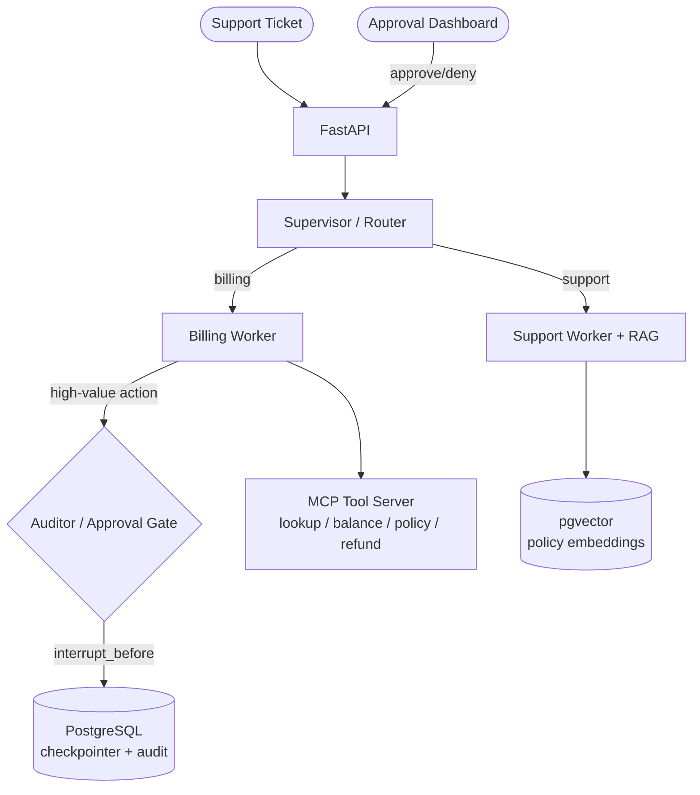

# Enterprise Resolution Desk

> Multi-agent customer-support automation with **sandboxed tool execution**, **durable state**, and **human-in-the-loop governance**.

[](https://github.com/kaixuan477/Agentic-Resolution-Desk/actions/workflows/ci.yml)


A supervisor agent routes incoming support tickets to specialized worker agents
that execute real business actions (refunds, account lookups, policy answers)
through a sandboxed tool layer. High-value actions are intercepted by a
deterministic policy gate and escalated to a human for approval. Every workflow
is durable and resumable after a crash.

**This is not a chatbot wrapper.** The engineering value is in what surrounds the
LLM: governance, durability, evaluation, observability, and cost control.

---

## Why this architecture

- **Sandboxing** — the LLM never holds credentials or touches backends directly.
  It can only act through the MCP tool server, which is the security boundary.
- **Determinism where it matters** — routing uses structured output; the refund
  approval threshold is hardcoded policy, not an LLM judgment call.
- **Durability** — workflow state is checkpointed to PostgreSQL. A crash mid-refund
  resumes from the exact step it failed on — it does not restart and double-bill.
- **Least privilege** — the Support worker cannot issue refunds; only the Billing
  worker can, and only through the audited tool layer.

---

## Architecture



The full engineering blueprint (milestones, benchmark plan, and monthly roadmap)
is summarized in the **Project status** and roadmap sections below.

---

## Tech stack

| Layer | Choice |
|---|---|
| Orchestration | LangGraph (`StateGraph`, checkpointer, interrupts) |
| State | Pydantic v2 |
| API | FastAPI |
| Tool protocol | Model Context Protocol (`fastmcp`) |
| Persistence | PostgreSQL (`PostgresSaver`) |
| Vector store | pgvector |
| LLM | Provider-abstracted (OpenAI default) |
| Infra | Docker Compose |

---

## Quick start

```bash
# 1. Configure
cp .env.example .env        # add your OPENAI_API_KEY

# 2. Bring up Postgres (+pgvector), MCP server, and the API
docker compose up --build

# 3. Health check
curl http://localhost:8000/health
```

### Local development

```bash
python -m venv .venv && . .venv/Scripts/activate   # PowerShell: .venv\Scripts\Activate.ps1
pip install -e ".[dev]"
pytest -q
ruff check src tests
```

---

## Project status — building toward v1.0

Current milestone: **M3 — Supervisor routing** (structured-output intent
classification). M1 foundations and M2 tool-server hardening are done.

| Milestone | Scope | Status |
|---|---|---|
| M1 | Foundations & infra | ✅ done |
| M2 | MCP tool server hardening | ✅ done |
| M3 | Supervisor routing (structured output) | 🚧 in progress |
| M4 | Worker agents + pgvector RAG | ⬜ |
| M5 | Human-in-the-loop approval | ⬜ |
| M6 | Approval dashboard | ⬜ |
| M7 | Audit + polish → `v1.0.0` | ⬜ |

See [CHANGELOG.md](CHANGELOG.md) for released changes.

---

## License

MIT
